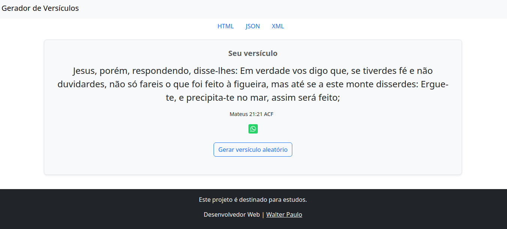
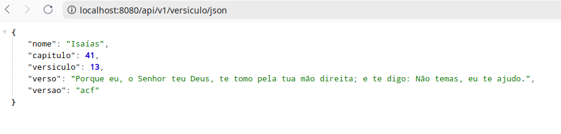
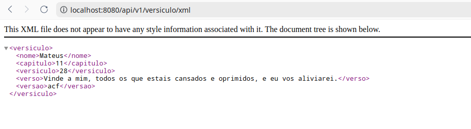

# Consume Versículo Bíblico de API

## Tecnologias utilizadas:

- `String Boot;`
- `Java 17;`
- `BootStrap;`
- `MVC;`
- `BootStrap;`
- `Thymeleaf;`
- `API;e`
- `JSON`

## Rotas:
- http://localhost:8080



- http://localhost:8080/api/v1/versiculo/json



- http://localhost:8080/api/v1/versiculo/xml



## Padrão Abstract Factory para retornar versículos no formato JSON ou XML


## Como iniciar o Spring com o `mvnw`:

Para iniciar o Spring Boot usando o `mvnw` (Maven Wrapper), siga estes passos:

1. Navegue até o diretório do seu projeto Spring Boot.
2. Execute o comando para iniciar o Spring Boot:

```
./mvnw spring-boot:run
```
Isso iniciará o aplicativo Spring Boot usando o Maven Wrapper.


## Como gerar e executar o arquivo JAR:

Para gerar e executar o arquivo JAR do seu projeto Spring Boot, siga estes passos:

1. Navegue até o diretório do seu projeto.
2. Execute o comando Maven para gerar o arquivo JAR:

```
./mvnw clean package

```
Isso irá compilar o projeto e gerar um arquivo JAR na pasta `target`.

3. Para executar o arquivo JAR, use o seguinte comando:

```
java -jar <nome_do_arquivo_jar>.jar

```

## Como subir o aplicativo com `java -jar geradorVersiculo`:

Para subir o aplicativo Spring Boot utilizando o comando `java -jar`, siga estes passos:

1. Certifique-se de ter gerado o arquivo JAR conforme mencionado acima.
2. Navegue até o diretório onde o arquivo JAR está localizado.
3. Execute o seguinte comando para iniciar o aplicativo:

```
java -jar <nome_do_arquivo_jar>.jar

```


## Este projeto é destinado para estudos!


